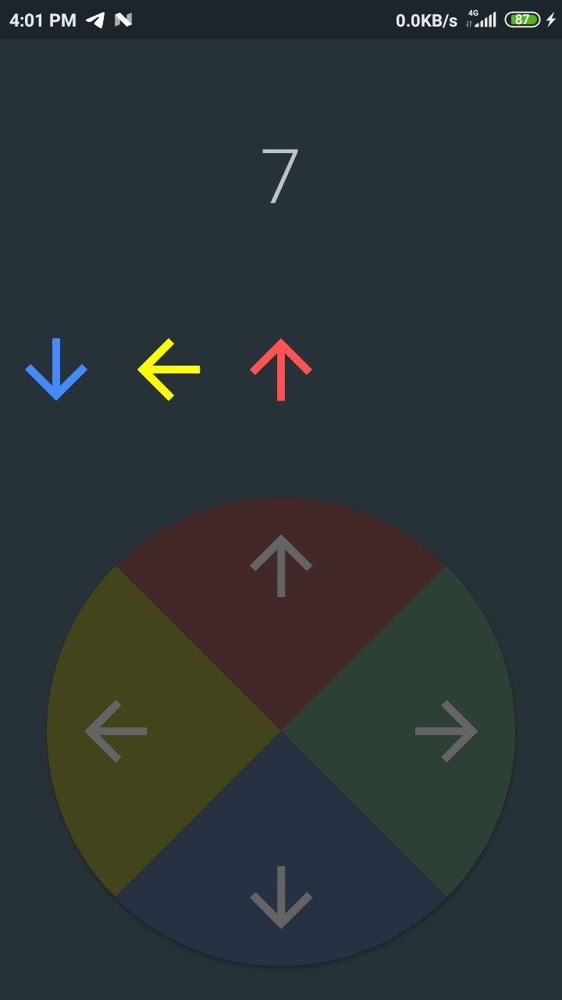
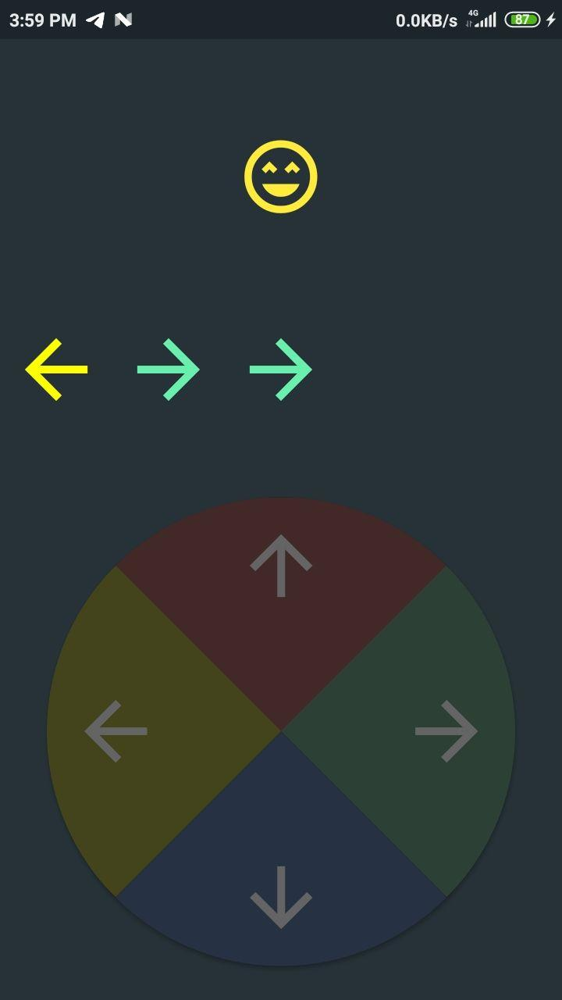
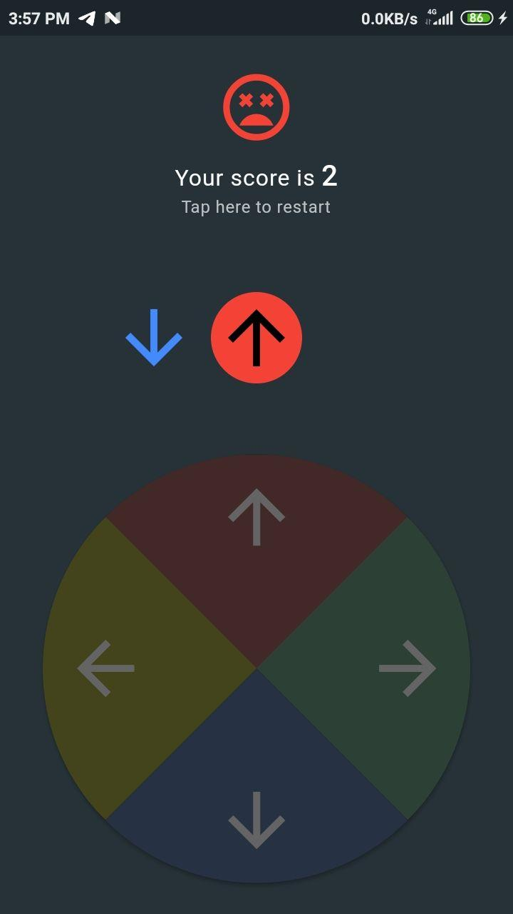

# Imitate

A simple Simon-like memory game for mobiles, built with Flutter.

---

More to be added later.

## How to play

## Run this project

To build this project, you need to have [Flutter](https://flutter.dev/) installed in your system.

Then `flutter run`

